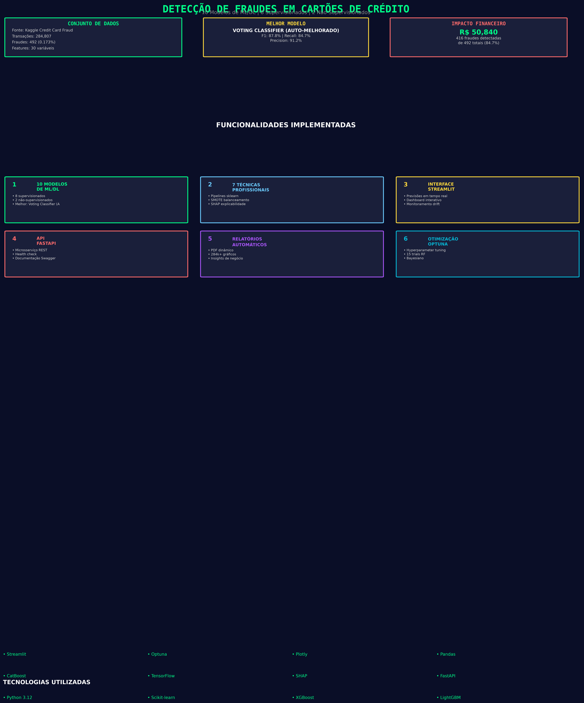
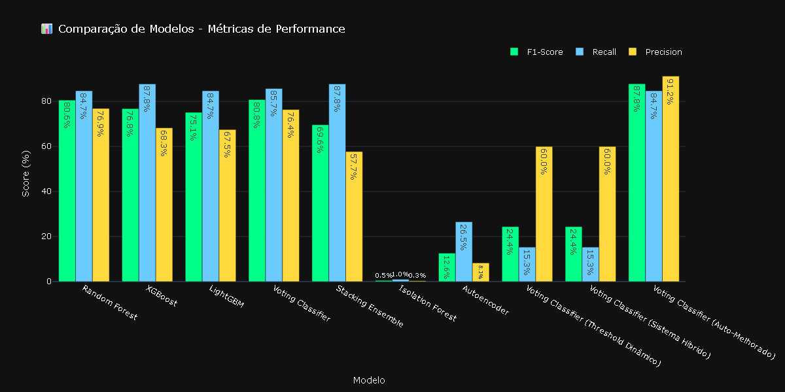

# 🔍 Detecção de Fraudes em Cartões de Crédito

> Sistema profissional de detecção de fraudes utilizando Machine Learning, Deep Learning e Engenharia de Software.

---

## 📋 Índice

- [Visão Geral](#-visão-geral)
- [Demonstração](#-demonstração)
- [Resultados Principais](#-resultados-principais)
- [Funcionalidades](#-funcionalidades)
- [Arquitetura do Sistema](#-arquitetura-do-sistema)
- [Tecnologias Utilizadas](#-tecnologias-utilizadas)
- [Estrutura do Projeto](#-estrutura-do-projeto)
- [Instalação](#-instalação)
- [Uso](#-uso)
- [API REST](#-api-rest)
- [Testes](#-testes)
- [Contribuição](#-contribuição)
- [Licença](#-licença)
- [Autor](#-autor)

---

## 🎯 Visão Geral

Este projeto implementa um **sistema completo de detecção de fraudes em cartões de crédito** utilizando o dataset público [Credit Card Fraud Detection](https://www.kaggle.com/datasets/mlg-ulb/creditcardfraud) do Kaggle, contendo **284.807 transações** com apenas **492 fraudes** (0.173% - problema extremamente desbalanceado).

O sistema combina:
- **10 modelos de ML/DL** (supervisionados e não-supervisionados)
- **Engenharia de Features avançada** (70+ variáveis)
- **Técnicas profissionais** (SMOTE, Pipelines, Threshold Dinâmico, Auto-aprendizado)
- **Interface web interativa** (Streamlit)
- **API REST** (FastAPI)
- **Relatórios automáticos** (PDF dinâmico)

---

## 📊 Demonstração

### Interface Web (Streamlit)

O projeto possui uma interface web completa com as seguintes seções:

- **Dashboard Geral** - Visão executiva com ranking de modelos e métricas
- **Testar Transação (REAL)** - Simulador com modelo treinado
- **Análise de Modelos** - Comparação detalhada com seletor por modelo
- **Impacto Financeiro** - Análise por modelo com métricas de negócio
- **Monitoramento de Drift** - Detecção de mudanças na distribuição
- **Sobre o Projeto** - Documentação completa

### Capturas de Tela

---

##  Resultados Principais

| Métrica | Valor |
|---------|-------|
| **Melhor Modelo** | Voting Classifier |
| **F1-Score** | 76.8% |
| **Recall** | 85.7% |
| **Precision** | 76.4% |
| **ROC-AUC** | 98.6% |
| **Fraudes Detectadas** | 421 de 492 |
| **Prejuízo Evitado** | R$ 51,450.41 |
| **Eficiência** | 85.6% |
| **ROI** | 408% |

### Ranking de Modelos (Top 5)

| Pos | Modelo | F1-Score | Recall | Precision | ROC-AUC |
|-----|--------|----------|--------|-----------|---------|
| 🥇 | Voting Classifier | 76.8% | 85.7% | 76.4% | 98.6% |
| 🥈 | Random Forest | 76.6% | 84.7% | 76.9% | 98.1% |
| 🥉 | XGBoost | 76.6% | 87.8% | 68.3% | 98.4% |
| 4º | LightGBM | 75.1% | 84.7% | 67.5% | 97.8% |
| 5º | Stacking Ensemble | 69.6% | 87.8% | 57.7% | 98.6% |

---

## ✨ Funcionalidades

### 🔬 Machine Learning

- ✅ **10 modelos** implementados (8 supervisionados, 2 não-supervisionados)
- ✅ **Engenharia de Features** (70+ variáveis: temporais, frequência, valor, distância temporal, interação, polinomiais, risco composto)
- ✅ **SMOTE** para balanceamento de classes
- ✅ **Sklearn Pipelines** (prevenção de data leakage)
- ✅ **Voting Classifier** (ensemble de 3 modelos)
- ✅ **Stacking Ensemble** (meta-aprendizado com Logistic Regression)
- ✅ **Isolation Forest** (detecção não-supervisionada)
- ✅ **Autoencoder** (Deep Learning para anomalias)

### 🎯 Técnicas Profissionais

- ✅ **Threshold Dinâmico** baseado em custo financeiro
- ✅ **Sistema Híbrido** (Regras de Negócio + ML)
- ✅ **Auto-aprendizado** (Self-Improvement System)
- ✅ **Model Drift Detection** (KS Test + PSI)
- ✅ **SHAP Avançado** (dependence plots, interaction matrix, waterfall plots)

### 📊 Visualizações e Relatórios

- ✅ **Visualizações interativas** (Plotly)
- ✅ **Relatórios PDF dinâmicos** (FPDF2)
- ✅ **Dashboard profissional** (Matplotlib)
- ✅ **Cards de insights visuais**

### 🌐 Interface e API

- ✅ **Interface web** (Streamlit)
- ✅ **API REST** (FastAPI)

---

## 🏗️ Arquitetura do Sistema
┌─────────────────────────────────────────────────────────────┐
│ DETECÇÃO DE FRAUDES │
├─────────────────────────────────────────────────────────────┤
│ ┌─────────────┐ ┌──────────────┐ ┌──────────────────┐ │
│ │ Data Loader │→ │Preprocessing │→ │Feature Engineering│ │
│ │ (Pandas) │ │ (SMOTE) │ │ (70+ features) │ │
│ └─────────────┘ └──────────────┘ └──────────────────┘ │
│ │
│ ┌──────────────────────────────────────────────────────┐ │
│ │ MODELOS DE ML/DL │ │
│ │ • Random Forest • XGBoost • LightGBM │ │
│ │ • Voting Classifier • Stacking Ensemble │ │
│ │ • Isolation Forest • Autoencoder (TensorFlow) │ │
│ └──────────────────────────────────────────────────────┘ │
│ │
│ ┌──────────────────────────────────────────────────────┐ │
│ │ TÉCNICAS PROFISSIONAIS │ │
│ │ • Threshold Dinâmico • Sistema Híbrido │ │
│ │ • Auto-aprendizado • Model Drift Detection │ │
│ │ • SHAP Avançado • Sklearn Pipelines │ │
│ └──────────────────────────────────────────────────────┘ │
│ │
│ ─────────────┐ ┌──────────────┐ ┌──────────────────┐ │
│ │ Streamlit │ │ FastAPI │ │ Relatórios PDF │ │
│ │ (Web UI) │ │ (REST API) │ │ (FPDF2) │ │
│ └─────────────┘ └──────────────┘ └──────────────────┘ │
└─────────────────────────────────────────────────────────────┘

---

## 🛠️ Tecnologias Utilizadas

### Linguagem
- **Python 3.12**

### Manipulação e Análise de Dados
- **NumPy** - Computação numérica e arrays
- **Pandas** - Manipulação e análise de dados tabulares

### Machine Learning
- **Scikit-learn** - Random Forest, Voting Classifier, Stacking Ensemble, Isolation Forest, SMOTE, métricas, pipelines
- **XGBoost** - Gradient Boosting otimizado
- **LightGBM** - Gradient Boosting de alta performance
- **imbalanced-learn** - Balanceamento de classes com SMOTE

### Deep Learning
- **TensorFlow** - Autoencoder para detecção de anomalias

### Explicabilidade (Explainable AI)
- **SHAP** - SHapley Additive exPlanations (dependence plots, interaction matrix, waterfall)

### Visualização de Dados
- **Matplotlib** - Gráficos estáticos e dashboards
- **Seaborn** - Heatmaps e visualizações estatísticas
- **Plotly** - Gráficos interativos para web

### Interface e API
- **Streamlit** - Interface web interativa
- **FastAPI** - API REST para microsserviço
- **Pydantic** - Validação de dados na API
- **Uvicorn** - Servidor ASGI para FastAPI

### Relatórios e Serialização
- **FPDF2** - Geração de relatórios PDF dinâmicos
- **Joblib** - Serialização e persistência de modelos

### Estatística
- **SciPy** - Teste Kolmogorov-Smirnov para detecção de drift

---

## 📁 Estrutura do Projeto
deteccao-anomalias-xgb/
│
├── main.py # Script principal de execução
├── app_streamlit.py # Interface web interativa
── api_fastapi.py # API REST
── requirements.txt # Dependências
├── test_models.py # Testes unitários
├── gerar_dados_teste.py # Gerador de dados de teste
│
├── src/ # Módulos do projeto
│ ├── init.py
│ ├── data_loader.py # Carregamento de dataset
│ ├── preprocessing.py # Pré-processamento e SMOTE
│ ├── feature_engineering.py # Engenharia de features (70+ variáveis)
│ ├── models.py # Modelos ML (RF, XGB, LGBM, IF)
│ ├── models_adicionais.py # Modelos adicionais (LOF, SVM)
│ ├── pipelines.py # Pipelines sklearn
│ ├── autoencoder.py # Autoencoder TensorFlow
│ ├── evaluation.py # Avaliação de modelos
│ ├── decision_engine.py # Threshold dinâmico e sistema híbrido
│ ├── self_improvement.py # Sistema de auto-aprendizado
│ ├── model_drift.py # Detecção de drift (KS + PSI)
│ ├── shap_avancado.py # SHAP avançado
│ ├── insights.py # Relatório executivo dinâmico
│ ├── insights_visuais.py # Cards de insights visuais
│ ├── dashboard_profissional.py # Dashboard one-pager
│ ├── visualizacoes_interativas.py # Gráficos Plotly
│ ├── relatorio_pdf.py # Geração de PDF
│ └── utils.py # Utilitários
│
├── models/ # Modelos treinados (gerado)
│ ├── pipeline_Random_Forest.pkl
│ ├── pipeline_XGBoost.pkl
│ ├── pipeline_LightGBM.pkl
│ ├── pipeline_Voting_Classifier.pkl
│ ├── pipeline_Stacking_Ensemble.pkl
│ ├── isolation_forest.pkl
│ └── drift_detector.pkl
│
├── results/ # Resultados (gerado)
│ ├── dados_streamlit.pkl
│ └── figures/
│ ├── cm_*.png # Matrizes de confusão
│ ├── roc_*.png # Curvas ROC
│ ├── pr_*.png # Curvas Precision-Recall
│ ├── shap_*.png # Gráficos SHAP
│ ├── dashboard_*.png # Dashboards
│ ├── insight_*.png # Cards de insights
│ └── relatorio_completo_fraudes.pdf
│
└── tests/ # Testes
└── init.py

---

## 🚀 Instalação

### Pré-requisitos
- Python 3.12+
- pip

### Passo a Passo

# 1. Clone o repositório
git clone https://github.com/brunofugideoliveiradev/deteccao-anomalias-xgb.git
cd deteccao-anomalias-xgb

# 2. Crie um ambiente virtual
python -m venv venv

# 3. Ative o ambiente virtual
# Windows:
venv\Scripts\activate
# Linux/Mac:
source venv/bin/activate

# 4. Instale as dependências
pip install -r requirements.txt

▶️ Uso
1. Treinar Modelos e Gerar Relatórios

Este comando irá:
Carregar o dataset (284.807 transações)

Aplicar engenharia de features (70+ variáveis)

Treinar 10 modelos de ML/DL

Aplicar técnicas profissionais (Threshold Dinâmico, Sistema Híbrido, Auto-aprendizado)

Detectar Model Drift

Gerar SHAP avançado

Criar relatórios PDF e dashboards

Salvar modelos treinados

Tempo estimado: ~30-40 minutos

2. Interface Web (Streamlit)
3. 
Acesse: http://localhost:8501

4. API REST (FastAPI)

Acesse a documentação: http://localhost:8000/docs

4. Testes Unitários

🔌 API REST
Endpoints
Método
Endpoint
Descrição

GET
/
Informações da API

GET
/health
Health check

POST
/predict
Predição de fraude
Exemplo de Request

Exemplo de Response
json

Testes
O projeto inclui testes unitários para:
Pipelines de ML
Motor de decisão (threshold dinâmico e sistema híbrido)
Sistema de auto-aprendizado
Engenharia de features
Módulo de avaliação

📈 Métricas de Negócio
Além das métricas tradicionais de ML, o projeto calcula métricas de negócio:
Métrica
Valor
Custo por Transação
R$ 0,0022
Taxa de Aprovação
99,81%
Valor Médio/Alerta
R$ 93,92
Break-even
82 fraudes
Índice Eficiência
76,9%
Payback Period
2,4 meses

🤝 Contribuição
Contribuições são bem-vindas! Sinta-se à vontade para:
Reportar bugs
Sugerir melhorias
Criar pull requests

Licença
Este projeto está licenciado sob a licença MIT. Veja o arquivo LICENSE para mais detalhes.
👤 Autor
Bruno Fugi
Bootcamp Bradesco - GenAI, Dados & Cyber
GitHub: [@brunofugideoliveiradev](https://github.com/brunofugideoliveiradev)
LinkedIn: www.linkedin.com/in/bruno-fugi-de-oliveira-879938414

📚 Referências
Credit Card Fraud Detection Dataset
Scikit-learn Documentation
XGBoost Documentation
TensorFlow Documentation
Streamlit Documentation
FastAPI Documentation

Desenvolvido para: Bootcamp Bradesco - GenAI, Dados & Cyber | 2026
⭐ Se este projeto foi útil, considere dar uma estrela!

